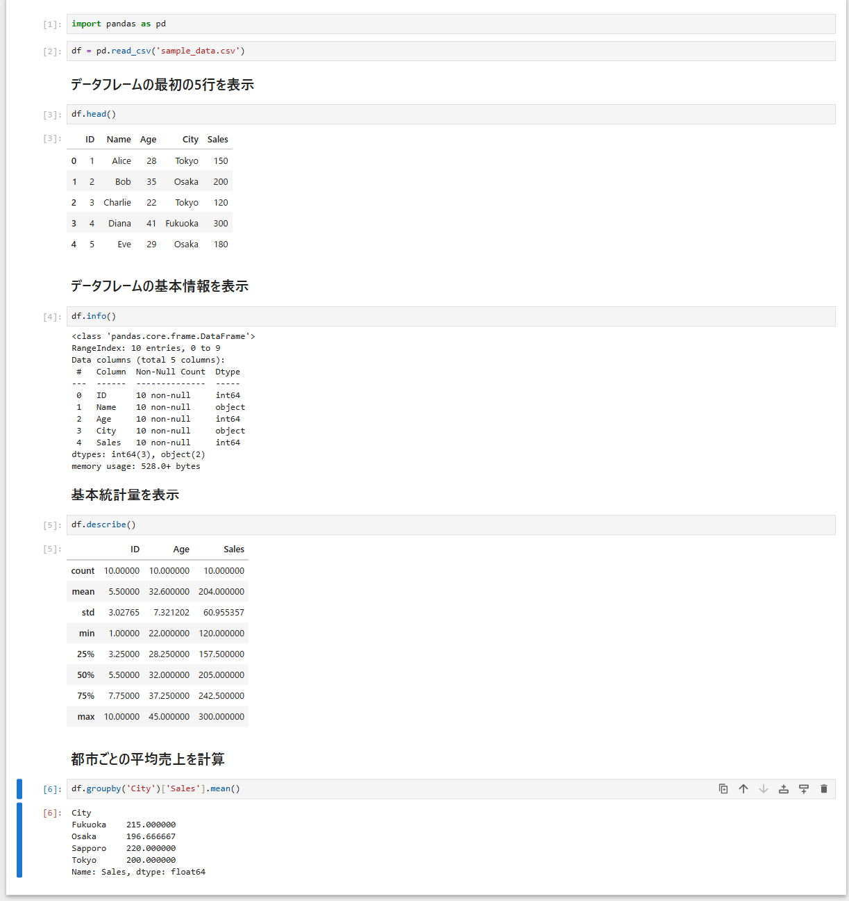
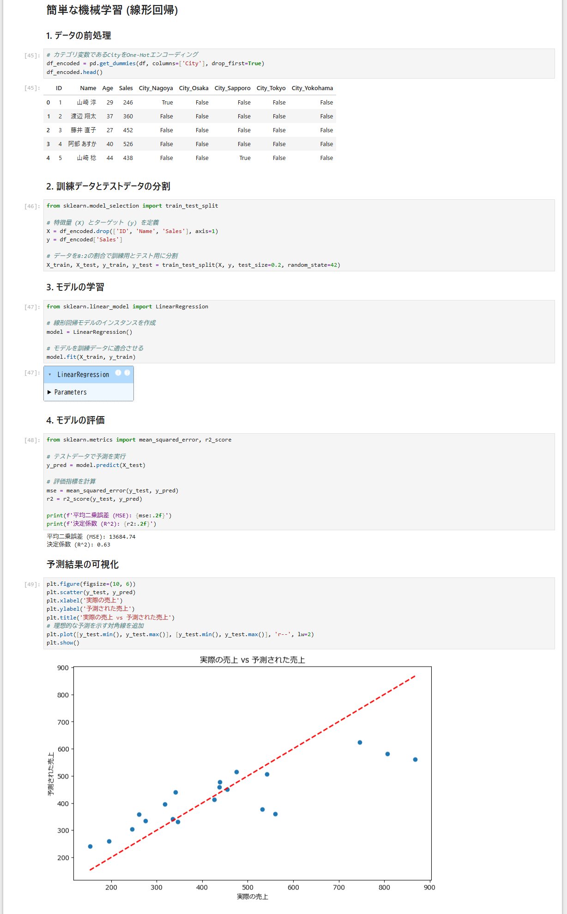

# データ分析環境構築と分析の手順

CSVデータを用いた基本的なデータ分析環境の構築から、可視化、機械学習までの詳細な手順。

## 1. サンプルデータの作成

「簡単なデータ分析を試したい」という要望に応え、散布図で傾向を把握できるよう、分析対象となるサンプルデータを作成した。

- **ファイル名:** `sample_data.csv`
<details>
<summary>CSVデータの内容を表示</summary>

```csv
ID,Name,Age,City,Sales
1,山崎 淳,29,Nagoya,246
2,渡辺 翔太,37,Fukuoka,360
3,藤井 直子,27,Fukuoka,452
4,阿部 あすか,40,Fukuoka,526
5,山崎 稔,44,Sapporo,438
6,小林 里佳,21,Tokyo,180
7,中村 千代,28,Osaka,290
8,清水 直子,25,Sapporo,337
9,山本 直人,65,Nagoya,473
10,佐々木 七夏,29,Fukuoka,253
11,加藤 千代,39,Sapporo,426
12,渡辺 直樹,31,Sapporo,312
13,清水 知実,22,Nagoya,153
14,岡本 智也,25,Yokohama,208
15,吉田 結衣,37,Sapporo,373
16,清水 くみ子,54,Tokyo,280
17,鈴木 春香,23,Tokyo,368
18,三浦 加奈,41,Yokohama,536
19,坂本 和也,52,Nagoya,475
20,小林 千代,32,Yokohama,234
21,石井 香織,48,Osaka,654
22,石井 春香,56,Osaka,291
23,鈴木 康弘,42,Sapporo,341
24,高橋 美加子,39,Nagoya,292
25,佐藤 香織,58,Tokyo,379
26,佐藤 修平,55,Yokohama,267
27,岡田 稔,43,Osaka,356
28,山本 修平,44,Osaka,577
29,加藤 篤司,26,Osaka,317
30,田中 陽子,35,Nagoya,146
31,吉田 さゆり,43,Sapporo,455
32,佐藤 舞,35,Sapporo,532
33,田中 幹,23,Nagoya,387
34,森 修平,48,Nagoya,439
35,坂本 晃,38,Nagoya,346
36,小林 直人,51,Sapporo,418
37,西村 智也,30,Tokyo,490
38,田中 裕美子,30,Nagoya,368
39,鈴木 千代,24,Fukuoka,215
40,佐藤 舞,51,Yokohama,542
41,井上 美加子,65,Tokyo,737
42,岡田 春香,21,Yokohama,257
43,小林 七夏,39,Osaka,237
44,鈴木 里佳,56,Osaka,405
45,森 英樹,57,Osaka,807
46,小川 加奈,30,Osaka,275
47,小林 陽一,23,Sapporo,133
48,池田 修平,58,Osaka,711
49,木村 亮介,46,Fukuoka,270
50,山下 結衣,24,Tokyo,191
51,田中 結衣,30,Nagoya,153
52,渡辺 英樹,63,Yokohama,710
53,村上 千代,65,Tokyo,438
54,藤田 和也,35,Tokyo,335
55,佐藤 康弘,25,Fukuoka,134
56,山本 香織,44,Sapporo,331
57,中村 陽子,34,Tokyo,273
58,伊藤 香織,59,Fukuoka,447
59,伊藤 美加子,35,Osaka,568
60,山崎 真綾,35,Nagoya,568
61,橋本 拓真,46,Osaka,711
62,中島 さゆり,40,Yokohama,624
63,太田 知実,29,Osaka,375
64,高橋 太郎,31,Tokyo,169
65,木村 真綾,21,Fukuoka,249
66,山本 学,53,Yokohama,582
67,田中 桃子,48,Yokohama,202
68,坂本 晃,48,Yokohama,307
69,中村 充,58,Sapporo,887
70,佐藤 淳,29,Osaka,115
71,中川 修平,33,Sapporo,261
72,吉田 さゆり,65,Fukuoka,538
73,松田 翼,31,Yokohama,358
74,池田 あすか,59,Tokyo,868
75,小川 さゆり,65,Nagoya,986
76,鈴木 陽一,53,Nagoya,608
77,加藤 浩,24,Yokohama,195
78,伊藤 直樹,39,Yokohama,318
79,山本 あすか,33,Nagoya,222
80,清水 千代,49,Tokyo,535
81,田中 治,32,Nagoya,346
82,村上 治,22,Fukuoka,103
83,鈴木 明美,35,Fukuoka,320
84,山田 翔太,64,Nagoya,746
85,鈴木 桃子,41,Tokyo,470
86,清水 真綾,65,Fukuoka,506
87,前田 花子,44,Fukuoka,305
88,鈴木 太一,44,Sapporo,544
89,池田 七夏,59,Tokyo,914
90,長谷川 和也,21,Osaka,330
91,伊藤 花子,35,Nagoya,560
92,遠藤 桃子,51,Fukuoka,496
93,中村 真綾,45,Fukuoka,232
94,伊藤 結衣,64,Sapporo,624
95,鈴木 直樹,61,Nagoya,572
96,木村 美加子,55,Yokohama,786
97,加藤 充,53,Nagoya,513
98,田中 七夏,37,Fukuoka,286
99,伊藤 七夏,46,Yokohama,551
100,池田 直人,22,Tokyo,146
```

- **件数:** 100件
- **生成方法:** `Faker`ライブラリを使用し、Pythonスクリプトで生成。
  - `Faker`ライブラリのインストール:
    ```bash
    python -m pip install Faker --user
    ```
  - データ生成スクリプトの実行:
    ```bash
    python generate_data.py
    ```
  - `generate_data.py` の削除:
    ```bash
    del generate_data.py
    ```

## 2. Jupyter Notebook環境の構築

「`sample_data.csv`の分析をJupyter Notebookで作成したい」というリクエストに基づき、データ分析ツールとしてのJupyterと、分析に必要なライブラリをインストールした。

1. **Jupyter Notebook / jupytext のインストール:**
   - Jupyter Notebookのインストール:
     ```bash
     python -m pip install notebook --user
     ```
   - `jupytext`のインストール（`.py`から`.ipynb`への変換用）:
     ```bash
     python -m pip install jupytext --user
     ```

2. **データ分析ライブラリ (pandas) のインストール:**
   ```bash
   python -m pip install pandas --user
   ```

3. **Jupyterカーネルの設定:**
   Jupyter Notebook実行時に発生した`ModuleNotFoundError`を解決するため、Jupyterが使用するPython環境を明示的に登録した。
   ```bash
   python -m ipykernel install --user --name=my-python-env --display-name="My Python Env"
   ```

## 3. Jupyter Notebookの作成

Jupyter Notebookのファイル破損問題（`SyntaxError`）を回避するため、Pythonスクリプトから変換する方式を採用した。

1. **分析コードを記述した `analysis.py` を作成。**
2. **`.ipynb` ファイルへ変換:**
   ```bash
   python -m jupytext --to notebook analysis.py -o analysis.ipynb
   ```
3. **不要ファイルの削除とリネーム:**
   - `analysis.ipynb` (旧版), `analysis_v2.ipynb` (旧版), `analysis.py` を削除。
   - `analysis_final.ipynb` を `analysis.ipynb` にリネーム。
   ```bash
   del analysis.ipynb analysis_v2.ipynb analysis.py
   move analysis_final.ipynb analysis.ipynb
   ```

## 4. データ分析の初歩（EDA）

`df.info()`の出力内容に関する質問（「これなに」）をきっかけに、作成した`analysis.ipynb`内で基本的なデータ分析（探索的データ分析: EDA）を実行した。

- **データの読み込みと確認:** `pd.read_csv()`, `df.head()` を用いてデータフレームを読み込み、最初の数行を確認。
- **データの概要把握:** `df.info()` を用いて、データ型、非null値の数、メモリ使用量などを確認。
- **基本統計量の確認:** `df.describe()` を用いて、数値データの平均、標準偏差、最小値、最大値などを確認。

### 初期分析結果


## 5. データ可視化

「まずはデータ可視化で」というリクエストに応え、データの傾向を視覚的に把握するため、グラフを作成した。

1. **可視化ライブラリのインストール:**
   ```bash
   python -m pip install matplotlib seaborn --user
   ```

2. **`analysis.ipynb` に以下のグラフ作成コードを追加:**
   - 都市ごとの売上 (棒グラフ)
   - 年齢の分布 (ヒストグラム)
   - 年齢と売上の関係 (散布図)

### 可視化結果


## 6. 簡単な機械学習

「簡単な機械学習も行いたい」という要望に基づき、売上を予測する線形回帰モデルを構築した。

1. **機械学習ライブラリのインストール:**
   ```bash
   python -m pip install scikit-learn --user
   ```

2. **`analysis.ipynb` に以下の処理コードを追加:**
   - **データの前処理:** カテゴリ変数である「都市」を数値に変換 (One-Hotエンコーディング)。
   - **訓練・テスト分割:** データを学習用と評価用に分割。
   - **モデルの学習:** 線形回帰モデルを学習。
   - **モデルの評価:** 決定係数（R^2）などで精度を評価し、結果を可視化。

### 機械学習結果


## 7. レポートの生成

「ここまでやったことをhtmlで資料として見れるようにしてほしい」という要望から、作業内容をまとめたHTMLレポートを生成した。

1. **`setup_and_analysis_summary.md` の作成と更新:**
   - 作業の進行に合わせて、Markdown形式で手順書を作成・更新。
   - 各ステップのプロンプト要約、詳細なコマンド、画像などを埋め込み。

2. **HTML変換スクリプト `convert_to_html.py` の作成と実行:**
   - MarkdownファイルをHTMLに変換するPythonスクリプトを作成。
   - スクリプトを実行し、`analysis_report.html` を生成。
   ```bash
   python convert_to_html.py
   ```
   - `convert_to_html.py` の削除:
     ```bash
     del convert_to_html.py
     ```

3. **Jupyter NotebookからのHTMLレポート生成:**
   - Jupyter Notebookの実行結果をすべて含んだHTMLレポート `analysis.html` を生成。
   ```bash
   python -m nbconvert --to html --execute analysis.ipynb
   ```
   - `analysis_report.html` (旧版) の削除:
     ```bash
     del analysis_report.html
   ```
